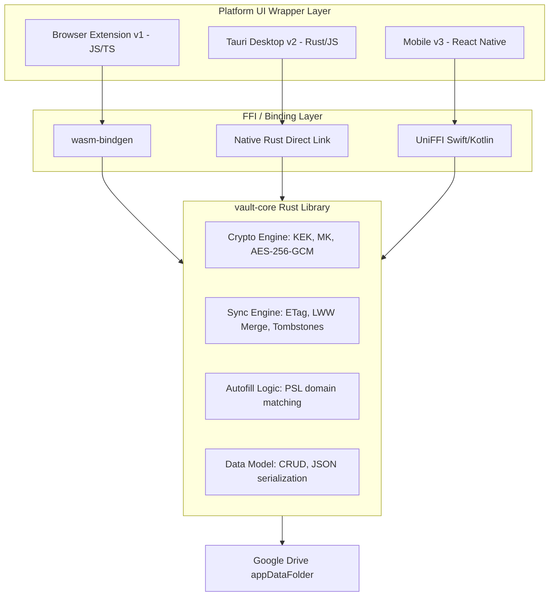

# KeyVault — System Design Document

**Status:** Approved (Active)  
**Target Versions:** v1 (Browser Extension) · v2 (Tauri Desktop) · v3 (Mobile)  

---

## 1. High-Level Architecture

KeyVault utilizes a **local-first, shared-core architecture**. All business logic, cryptography, sync rules, and data structures are implemented once in a native Rust library called `vault-core`. The platform wrappers serve only as native UI shells and token storage vaults.



---

## 2. Cryptographic Architecture & Key Hierarchy

To enable safe master password changes and persistent offline recovery keys, KeyVault utilizes a two-tier key hierarchy.

### 2.1 Keys & Secrets
*   **Master Password:** The user's memorized secret. Used solely to derive the KEK.
*   **Key Encryption Key (KEK):** Derived via `Argon2id` from the master password and a salt. Used to encrypt the Master Key.
*   **Recovery Key (RK):** Derived from a 128-bit random recovery code printed in the Emergency Kit. Used to encrypt the Master Key.
*   **Master Key (MK):** A cryptographically secure random 256-bit symmetric key generated once on onboarding. All actual vault payload entries are encrypted/decrypted using the Master Key.

### 2.2 Key Wrapping Flow
The local database and the remote Google Drive store the following layout:
```json
{
  "version": 1,
  "argon2_params": {
    "m": 65536,
    "t": 3,
    "p": 1
  },
  "salt_b64": "...",
  "encrypted_master_key": {
    "nonce_b64": "...",
    "ciphertext_b64": "..."
  },
  "encrypted_recovery_key": {
    "nonce_b64": "...",
    "ciphertext_b64": "..."
  },
  "encrypted_vault_payload": "..."
}
```

```
[Master Password] ---> Argon2id ---> [KEK] 
                                      |
                                      v
[Encrypted Master Key] ------------> AES-256-GCM Decrypt ---> [Master Key (MK)]
                                                                   |
                                                                   v
[Encrypted Vault Payload] ----------------------------------> AES-256-GCM Decrypt ---> [Plaintext Vault (JSON)]
```

### 2.3 Argon2id Tuning
Argon2id parameters are compile-target specific to respect runtime boundaries (see [ADR 0002](file:///Users/jas/Code/passwd-manager/docs/adr/0002-target-specific-key-derivation.md)):
*   **WebAssembly (WASM):** `m=65536` (64 MB), `t=3` (iterations), `p=1` (parallelism). Limiting to a single thread prevents CPU overhead in the single-threaded WASM container.
*   **Native (Desktop/Mobile):** `m=65536` (64 MB), `t=3` (iterations), `p=4` (parallelism) to utilize multi-core processors.

### 2.4 Payload Padding
To prevent size-based side-channel attacks on Google Drive, the plaintext vault payload is padded (see [ADR 0007](file:///Users/jas/Code/passwd-manager/docs/adr/0007-encrypted-payload-padding.md)):
1.  Serialize the vault entries to JSON.
2.  Prepend a 4-byte big-endian length header representing the exact length of the JSON string.
3.  Pad the block with random bytes until its total size is a multiple of **4 KB** (4096 bytes).
4.  Encrypt the padded block using AES-256-GCM.

### 2.5 JS/WASM Memory Zeroization
To protect keys from browser heap extraction (see [ADR 0010](file:///Users/jas/Code/passwd-manager/docs/adr/0010-secret-zeroization-in-js-wasm.md)):
*   All sensitive values (master password, keys) cross the JS/WASM boundary using mutable `Uint8Array` objects instead of immutable JS strings.
*   JS wrappers must execute `array.fill(0)` immediately after passing the array to WASM.
*   Rust structures implement the `Zeroize` trait to wipe memory buffers on drop.

---

## 3. Data Model

### 3.1 VaultEntry
Each entry represents a credential or secure note.
```rust
struct VaultEntry {
    id: Uuid,                      // UUID v4
    entry_type: EntryType,         // Login | SecureNote
    title: String,
    urls: Vec<String>,             // Multiple URLs supported for subdomain matching
    username: String,
    password: String,
    totp_secret: Option<String>,   // Encoded secret for local TOTP generation
    notes: String,
    custom_fields: Vec<CustomField> { key: String, value: String },
    password_history: Vec<PasswordSnapshot> { password: String, changed_at: DateTime },
    tags: Vec<String>,
    created_at: DateTime,
    updated_at: DateTime,
}
```

### 3.2 Tombstone
To prevent deleted entries from resurrecting during merges (see [ADR 0006](file:///Users/jas/Code/passwd-manager/docs/adr/0006-tombstones-for-deleted-entries.md)):
```rust
struct Tombstone {
    id: Uuid,
    deleted_at: DateTime,
}
```

---

## 4. Sync & Merging Protocol

Google Drive sync operates in the background utilizing the `appDataFolder` scope (hidden from the standard Drive UI).

### 4.1 Token Provider
The core sync module uses the `TokenProvider` trait to fetch Google API credentials (see [ADR 0004](file:///Users/jas/Code/passwd-manager/docs/adr/0004-oauth-token-management-boundary.md)):
```rust
pub trait TokenProvider {
    async fn get_access_token(&self) -> Result<String, SyncError>;
}
```

### 4.2 Merging Flow (LWW-Element-Set)
When a Google Drive ETag conflict is hit, KeyVault runs a client-side merge (see [ADR 0001](file:///Users/jas/Code/passwd-manager/docs/adr/0001-sync-merging-strategy.md)):
1.  **Pull & Decrypt:** Decrypt the local cache database and the incoming Google Drive remote database.
2.  **Reconcile Deletions:**
    *   Compare entries against the combined list of `tombstones` from both databases.
    *   If an entry matches a tombstone, and `entry.updated_at` < `tombstone.deleted_at`, delete the entry.
    *   If `entry.updated_at` > `tombstone.deleted_at`, preserve the entry and discard the tombstone (re-sharing/offline-restore case).
3.  **Reconcile Mutations:**
    *   Compare entries with the same `id` present in both vaults.
    *   Preserve the entry with the higher `updated_at` timestamp.
4.  **Tombstone Pruning:** Purge tombstones older than 30 days during sync.
5.  **Writeback:** Encrypt, pad, and upload the merged database to Google Drive, resolving the ETag conflict.

---

## 5. Platform Execution Roadmaps

### v1: Browser Extension (Web Target)
*   **Core Execution:** `vault-core` runs inside a dedicated **Web Worker** spawned by the Extension popup or service worker, keeping Argon2id computation away from the UI thread.
*   **Biometric Unlock:** Utilizes the **WebAuthn PRF (Pseudo-Random Function) Extension** (see [ADR 0003](file:///Users/jas/Code/passwd-manager/docs/adr/0003-biometric-unlock-architecture.md)). Derives a hardware-backed key to decrypt the Master Key without companion software.
*   **Autofill Security:**
    *   No auto-fill on page load. User must click popup or press `Ctrl+Shift+L`.
    *   Scans input visibility; ignores elements styled `display: none` or hidden.
    *   Validates frame origins: inputs inside an iframe are only filled if the iframe's origin matches the credential's domain.
*   **Clipboard Safety:** Clears copied passwords from the OS clipboard after 30 seconds (see [ADR 0008](file:///Users/jas/Code/passwd-manager/docs/adr/0008-clipboard-auto-clear.md)).

### v2: Tauri Desktop (Native Target)
*   **Core Execution:** Statically compiles `vault-core` directly into the Tauri Rust runtime.
*   **Secure Storage:** Integrates with native OS Keystore/Keychains (macOS Keychain, Windows Credential Manager) via Tauri plugins to store the OAuth Refresh Tokens and biometric wrapping keys.
*   **Native Messaging Host:** Tauri launches a local loopback or standard Chrome Native Messaging pipe. The Browser Extension (v1) can delegate biometrics to Tauri, facilitating single-sign-on (SSO) between browser and desktop.

### v3: Mobile (React Native Target)
*   **Core Execution:** Invokes `vault-core` functions through generated Swift and Kotlin bindings generated via **UniFFI** (see [ADR 0011](file:///Users/jas/Code/passwd-manager/docs/adr/0011-wasm-and-uniffi-bindings.md)).
*   **Biometrics:** Accesses FaceID / TouchID / Android Biometrics natively to unlock the Keychain-backed wrapping keys.
*   **Autofill:** Registers as a platform-native Autofill Service on iOS and Android, receiving credentials from the Rust core and injecting them into native app screens.
